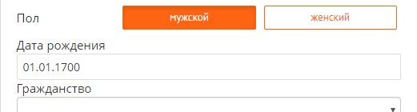
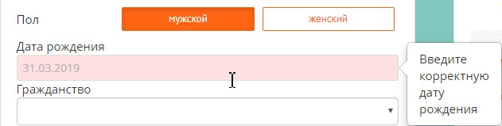

# Тесты
> Навигация:

- [Главная](README.md)
- [Список тестов](TEST.md)

#### (Баг #1) Данные гостя > Проверка Даты рождения 
1. Открыть ссылку https://preview-broken-in-u5auzt.bronevik.com/ru/info/russian-visa-invitation/
2. В поле "Дата рождения" написать 01.01.1700.
3. Выбрать следующее поле.

| Ожидаемый результат | Статус |
| ------ | ------ |
| Сообщение об ошибке: Введите корректную дату рождения | Не Выполнено |

#### (Баг #2) Данные гостя > Проверка Даты рождения 
1. Открыть ссылку https://preview-broken-in-u5auzt.bronevik.com/ru/info/russian-visa-invitation/
2. В поле "Дата рождения" написать сегодняшнюю дату.
3. Выбрать следующее поле.

| Ожидаемый результат | Статус |
| ------ | ------ |
| Дата принята | Не Выполнено|

#### (Баг #3) Данные гостя > Запрос визового приглашения

1. Открыть ссылку https://preview-broken-in-u5auzt.bronevik.com/ru/info/russian-visa-invitation/
2. В поле "Гражданство" из выпадающего списка выбрать страну для которых документы оформляются под запрос. К таким странам относится, например: Албания, Алжир, Мавритания и т.д. 
3. Нажать кнопку "Отправить заявку на приглашение".
4. Заполнить поле Имя - Иван.
5. `Некорректно` заполнить поле Email - "Почта123".
6. Нажать кнопку "Запросить".

| Ожидаемый результат | Статус |
| ------ | ------ |
| Сообщение об ошибке: введите корректный Email | Не Выполнено |
